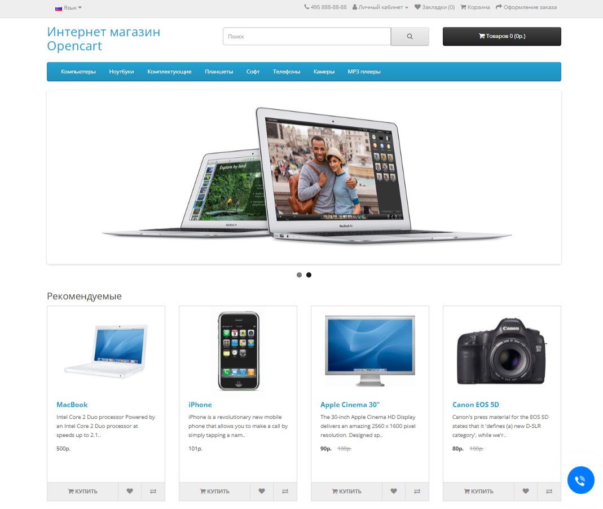

# Socials Feedback Widget for OpenCart

Модуль добавляет на сайт **плавающую кнопку обратной связи** в правом нижнем углу страницы. При клике на неё раскрывается список кнопок для быстрой связи через социальные сети и мессенджеры.



## Возможности

- 🌐 **Поддерживаемые платформы**: Telegram, WhatsApp, Viber, Facebook, Instagram, Email, Телефон, Max и произвольные ссылки
- 🎨 **Настраиваемый дизайн**: цвет главной кнопки, индивидуальные цвета и градиенты для каждой соцсети
- 🌍 **Мультиязычность**: отдельная настройка ссылок для каждого языка в магазине
- 🖼️ **Кастомные иконки**: возможность загрузить собственное изображение для каждой кнопки или использовать встроенные SVG-иконки
- ⚡ **Кэширование**: встроенное кэширование для снижения нагрузки на сервер
- 📱 **Адаптивный дизайн**: корректное отображение на мобильных устройствах
- ✨ **Анимации**: плавные переходы, пульсация главной кнопки и всплывающие подсказки при наведении

## Принцип работы

На всех страницах сайта в правом нижнем углу отображается анимированная кнопка. При нажатии на неё плавно появляется список настроенных каналов связи. Каждая кнопка ведёт на соответствующую соцсеть, открывает мессенджер, инициирует звонок или переход по произвольной ссылке.

## Требования

- OpenCart 3.x
- PHP 7.0+
- OCMod (встроен в OpenCart)

## Установка

### Способ 1: Через установщик расширений

1. Скачайте файл модуля `socials_feedback.ocmod.zip`
2. В админке перейдите в **Дополнения → Установка расширений**
3. Загрузите файл через кнопку загрузки
4. Перейдите в **Дополнения → Обновления модификаторов** и нажмите кнопку обновления
5. Перейдите в **Дополнения → Модули** и настройте модуль

### Способ 2: Вручную

1. Распакуйте архив
2. Скопируйте содержимое папки `upload` в корень вашего сайта
3. В админке перейдите в **Дополнения → Обновления модификаторов** и нажмите кнопку обновления
4. Перейдите в **Дополнения → Модули** и настройте модуль

## Настройка

После установки перейдите в **Дополнения → Модули → Виджет обратной связи**.

### Общие настройки

| Параметр | Описание |
|----------|----------|
| **Цвет фона кнопки** | Основной цвет плавающей кнопки (цветной пикер) |
| **Статус** | Включить/выключить отображение виджета на сайте |

### Настройка социальных ссылок

Для каждого языка можно настроить свой набор кнопок:

| Параметр | Описание |
|----------|----------|
| **Изображение** | Кастомная иконка кнопки (необязательно для предустановленных типов) |
| **Тип** | Тип ссылки: Ссылка, Телефон, Email, Max, Viber, Telegram, Facebook, Instagram, WhatsApp. При выборе автоматически подставляются цвет и иконка |
| **Цвет фона** | Индивидуальный цвет кнопки |
| **Название** | Текст, отображаемый при наведении на кнопку |
| **Ссылка/Контакт** | URL, номер телефона, email или логин |
| **Порядок сортировки** | Порядок отображения кнопок (0 = первый) |
| **Включить** | Показать/скрыть отдельную кнопку |

### Примеры заполнения

| Тип | Что указать в поле «Ссылка/Контакт» |
|-----|--------------------------------------|
| **Telegram** | `https://t.me/username` или `@username` |
| **WhatsApp** | `https://wa.me/79001234567` |
| **Viber** | `viber://chat?number=%2B79001234567` |
| **Email** | `info@example.com` (префикс `mailto:` добавится автоматически) |
| **Телефон** | `+79001234567` (префикс `tel:` добавится автоматически) |
| **Ссылка** | Любой URL, например `https://example.com` |

## Структура файлов

```
upload/
├── admin/
│   ├── controller/extension/module/socials_feedback.php
│   ├── language/
│   │   ├── en-gb/extension/module/socials_feedback.php
│   │   └── ru-ru/extension/module/socials_feedback.php
│   └── view/template/extension/module/socials_feedback.twig
└── catalog/
    ├── controller/extension/module/socials_feedback.php
    ├── language/
    │   ├── en-gb/extension/module/socials_feedback.php
    │   └── ru-ru/extension/module/socials_feedback.php
    ├── view/
    │   ├── javascript/socials_feedback/
    │   │   ├── style.css
    │   │   ├── script.js
    │   │   └── sf-social/*.svg
    │   └── theme/default/template/extension/module/socials_feedback.twig
```

## Удаление

1. В админке отключите модуль (Статус = Выключено)
2. Перейдите в **Дополнения → Модификаторы** и удалите модификатор `socials_feedback`
3. Удалите файлы модуля с сервера (опционально)
4. Обновите модификаторы

## Поддержка

| Контакт | Ссылка |
|---------|--------|
| **Email** | [alexsell72@gmail.com](mailto:alexsell72@gmail.com) |
| **Telegram** | [@AlexS735](https://t.me/AlexS735) |
| **GitHub** | [github.com/AlexSell0/opencart-socials-feedback](https://github.com/AlexSell0/opencart-socials-feedback) |

## Лицензия

GNU General Public License v3.0 — [https://www.gnu.org/licenses/gpl-3.0.html](https://www.gnu.org/licenses/gpl-3.0.html)

---

© 2024 AlexS. Все права защищены.
